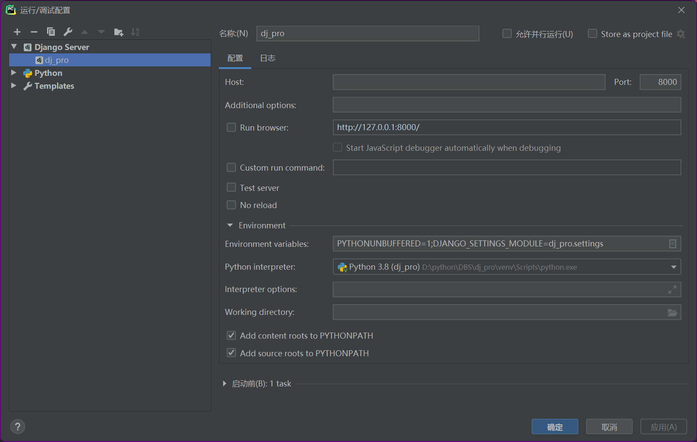

    如果老师想在自己电脑上运行我的源代码,需要进行以下几个步骤!
    1.python环境 python3.8
    2.可以通过配置当前目录下的虚拟环境venv目录进行运行
    按照下边的配置应该就可以运行了,当然这仅限省略了第一二步,第三步还需要进行

    
    也可以通过安装本次项目需要的所有第三方模块,通过 在terminal/当前目录控制台 输入以下命令 
    pip3 install -r requirement.txt
    ! 这里的模块可能下载的有点慢,如果需要换源可以通过清华源/阿里源
    # 清华源
    pip3 config set global.index-url https://pypi.tuna.tsinghua.edu.cn/simple
    # 阿里源
    pip3 config set global.index-url https://mirrors.aliyun.com/pypi/simple/
    
    3.创建数据库,配置!
    
    本次项目的数据库名称为MQbookstore
    在mysql命令行中输入(该项目我所用的mysql版本为mysql80)
    create database MQbookstore;
    # 创建用户
    create user 'wangmengqi'@'localhost' identified by 'wangmengqi123';
    # 赋予权限
    grant all privileges on mqbookstore.* to 'wangmengqi'@'localhost';
   
上一级目录下,有sql文件,可以直接还原,还原后应该就不需要数据库迁移了
    
    4.数据库迁移
    
    首先需要对dj_pro/apps/ 下的 book,user,home 各子目录下的migrations文件目录进行清空确保该目录里没有东西
    接着在控制台Terminal 或者cmd命令窗口下 进行数据库迁移
    输入以下命令
    python manage.py makemigrations
    python manage.py migrate
    
    5.启动服务
    在控制台Terminal或者cmd命令窗口下输入
    python manage.py runserver
    
    出现类似以下的提示代表运行成功
    System check identified no issues (0 silenced).
    December 18, 2021 - 14:48:19
    Django version 3.2.4, using settings 'dj_pro.settings'
    Starting development server at http://127.0.0.1:8000/
    Quit the server with CTRL-BREAK.
    
    !!! 注意
    这里仅仅只是后台的配置,前台配置需要看前台的readme.md
    验证码登录注册校验功能将于2022-03-19 11:43:59过期,该时间之后无法使用验证码登录,验证
    默认超级用户root 密码:root
    普通用户:16639821093 密码:123
    默认支付宝支付账户:cyqgyn2448@sandbox.com 密码:111111

    
    
    
    
    