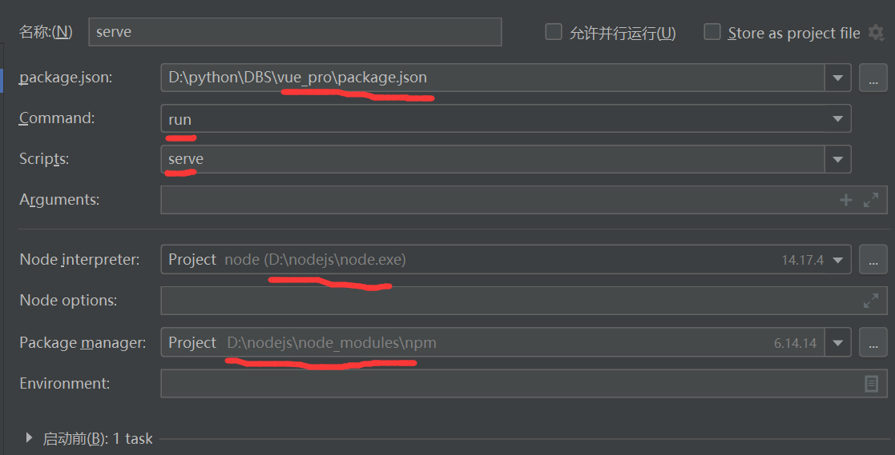

# 前端配置

1.原本可以打包好直接打开的,但不知道为什么打包了后没办法打开
所以只能进行配置

2.如果不出意外的话,node_modules目录 中已经安装好所需要的所有模块了,
这个我也不是很清楚......还是在细说一下我所有的配置最好

3.先换源在Terminal或者cmd中
npm install -g cnpm --registry=https://registry.npm.taobao.org

    下载需要的模块
    cnpm install axios
    cnpm install vue-cookies
    cnpm install element-ui
    cnpm install jquery
    cnpm install bootstrap@3

在运行按钮左边有一个编辑配置
按照下面的配置应该就可以运行了
